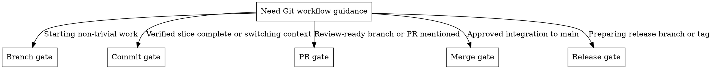

# Git Delivery Workflow

## Overview

Standardize Git decisions for this repository from the first branch cut to the final release tag. Core principle: one verified delivery slice per branch boundary, one review purpose per PR boundary, integration checkpoints for acceleration lanes, and no Git write action without explicit user approval.

**REQUIRED SUB-SKILL:** Use `superpowers:verification-before-completion` before recommending `commit`, `PR`, `merge`, or `release` actions.

## Trigger Map



Run this inspection block before choosing a gate:

```powershell
git status --short
git branch --show-current
git log --oneline --decorate -5
git diff --stat
```

Answer five questions:
- Is the worktree clean or mixed?
- What is the current branch objective?
- Is the current change a new delivery slice or continuation of the same slice?
- What fresh verification proves readiness?
- Is the next Git action `branch`, `commit`, `PR`, `merge`, or `release`?

When the current branch or target branch is listed in `docs/plans/function-one-acceleration-execution-plan.md`, also answer:

- Is this an acceleration lane branch, the integration branch, or `main`?
- Does the next action target `integration/function-one-acceleration` or `main`?
- Which claim ids and evidence reports are included?

## Branch Gate

Create a new branch by default for any new feature, bugfix, refactor, docs batch, or chore that is not the same unmerged delivery slice as the current branch.

Reuse the current branch only when all of these are true:
- The current branch is not merged.
- The new request continues the same user-facing or repo-facing objective.
- The diff will remain reviewable as one unit.
- The branch does not already contain a pending checkpoint that should be reviewed separately.

Do not reuse the current branch when any of these are true:
- The new task changes objective.
- The branch already contains a completed, reviewable slice.
- The worktree contains unrelated edits.
- The branch name no longer matches the actual scope.

Use these branch names:
- `feat/xxx` for new behavior
- `fix/xxx` for defect repair
- `refactor/xxx` for internal restructuring without behavior change
- `docs/xxx` for documentation-only changes
- `chore/xxx` for maintenance work
- `release/vX.Y.Z` for release stabilization branches when needed

Name the `xxx` segment after the delivery slice, not a technical layer. Prefer `feat/stage-orchestration` over `feat/backend-api`.

Default branch action:
- Start from `main` for new slices.
- If `main` may be stale, sync it first.
- Create the new branch with `git switch -c <branch-name>`.

For Function One acceleration mode:
- Lane branches use the exact branch names in `docs/plans/function-one-acceleration-execution-plan.md`.
- New lane work starts from `main` only when initially creating the lane branch.
- After an integration checkpoint exists, new claims should use the latest `integration/function-one-acceleration` state as their coordination base unless the acceleration plan says otherwise.
- Existing lane worktrees must report their current branch HEAD and dirty status before taking a new claim. If the lane is behind the latest integration checkpoint and needs integrated contracts, prepare a sync request before continuing.
- Do not create ad hoc branches for individual task slices inside a lane unless the user explicitly asks for a temporary repair branch.

If the worktree is dirty with unrelated edits, stop and ask the user how to separate the work before creating or switching branches.

## Commit Gate

Recommend a commit only when one coherent, verified checkpoint is ready. A checkpoint is ready when:
- The diff serves one objective.
- Fresh verification has been run for the changed scope.
- The files in the commit belong together.
- The user could safely pause or switch context after the commit.

Do not recommend a commit when:
- The change is still half-implemented.
- Verification is stale or missing.
- The diff mixes unrelated concerns.
- A draft spec document still needs user review.

Keep commits narrow:
- Separate spec approval commits from implementation commits.
- Separate behavior changes from pure refactors when practical.
- Avoid mixing formatting churn with logic changes unless the formatter touched the same files as part of the slice.

Use the repository commit standard:
- Subject format: `<type>(<scope>): <summary>`
- `scope` is required.
- For known `main` PR/MR review boundaries, append the compact review reference to the subject, e.g. `(#9)`, and keep it in `Refs`.
- Keep the subject imperative and within 72 characters.
- Use one of `feat`, `fix`, `refactor`, `docs`, `chore`, `test`, `build`, `ci`.
- Body is required for every commit and defaults to `Changes` and `Refs`.
- `Changes` uses as many bullets as the checkpoint needs. Do not pad short commits or compress dense commits to fit an artificial count.
- Fresh verification evidence is required in the commit approval request and later review gates.
- Keep verification evidence in approval and review material by default, not in the commit body.
- Do not add `Verification` to the commit body unless that evidence should remain attached to commit history.
- For documentation-only commits, `Verification` may be `manual review` when included.

Examples:
- `feat(orchestrator): add stage transition validation`
- `fix(delivery-record): repair status mapping`
- `refactor(context): extract preview target builder`
- `docs(spec): refine workflow terminology`
- `chore(dev): update local development tooling`
- `feat(persistence): add multi-sqlite boundary models (#9)`

When proposing a commit, include:
- Branch name
- Commit scope and rationale
- Fresh verification evidence
- Proposed commit message

Use `references/approval-request-templates.md` for the user-facing approval request.
Use `references/commit-message-template.txt` as the agent reference template.

## PR Gate

Treat PR readiness as a review boundary even if no remote PR is created yet.

Use `PR/MR` as the platform review boundary term:
- On GitHub, this is a Pull Request and can be operated through the web UI or `gh` CLI.
- On GitLab and similar platforms, this is a Merge Request and must follow the equivalent platform flow.
- Prefer platform PR/MR merge over local `git merge` followed by `git push origin main` whenever a PR/MR exists or is expected.

Recommend a PR when all of these are true:
- The branch has one review purpose.
- Fresh verification passed for the branch state.
- The branch is updated against current `main`.
- Remaining work, if any, belongs in a follow-up branch or follow-up PR.

Default update strategy before PR:
- Rebase onto `main` for local, unshared branches.
- Merge `main` into the branch instead of rebasing if the branch is already shared or rewriting history would be risky.
- If branch sharing status is unclear, ask before rewriting history.

Do not recommend a PR when:
- The branch still contains obvious WIP.
- The diff hides multiple objectives.
- Required spec approval is still pending.
- Verification has not been rerun after syncing with `main`.

Acceleration lane PR readiness:
- AL lane branches are PR/MR-ready for `integration/function-one-acceleration`, not for `main`.
- A lane PR/MR must list the claim ids, evidence reports, mock-first status, owner conflicts, and focused verification.
- `mock_ready` claims can be integrated only as partial progress and must not be represented as final platform task completion.
- Integration branch PR/MR to `main` is allowed only after the relevant integration checkpoint verification passes and global status updates are coherent.

When proposing a PR, include:
- PR title
- Scope summary
- Explicit non-goals
- Verification evidence
- Risks or follow-ups

If no PR tool is available, surface the branch as `PR-ready` and provide the prepared title/body using `references/approval-request-templates.md`.

For GitHub repositories with `gh` available:
- Check authentication with `gh auth status` before proposing GitHub CLI actions.
- Use `gh pr status` or `gh pr view <PR-number>` to inspect existing PR state.
- Use `gh pr create` only after explicit user approval if a PR does not already exist.
- Before PR/MR creation, verify `git log --oneline origin/main..<branch>` contains only the intended review commits. If it includes unrelated local `main` commits, sync those commits to `origin/main` first or rebase/split the branch before opening the PR/MR.

## Merge Gate

Merge into `main` only after the branch is approved for integration and verification is fresh.

For acceleration mode, there are two merge targets:

- Lane branch -> `integration/function-one-acceleration`
- `integration/function-one-acceleration` -> `main`

AL lane branches do not merge directly to `main` unless the user explicitly abandons acceleration mode and approves a different integration strategy.

Default merge path:
- If a PR/MR exists, merge through the hosting platform. For GitHub, prefer the web merge button or `gh pr merge <PR-number> --squash --delete-branch` after explicit user approval.
- Do not replace an open PR/MR merge with local `git merge` plus `git push origin main` unless the user explicitly approves bypassing the platform merge path.
- If the PR/MR has already been merged on the platform, do not merge locally. Switch to `main`, run `git pull --ff-only origin main`, and verify the expected commit is present.

Default merge strategy:
- Use `git merge --squash <branch>` for `feat/`, `fix/`, `refactor/`, `docs/`, and `chore/` branches.
- Use `git merge --no-ff <branch>` only when preserving branch commit history has clear value and the user approves that strategy.

Pre-merge checklist:
- `main` is current.
- The branch is current relative to `main`.
- Verification has been rerun on the final merge candidate.
- The merge will not pull in unrelated WIP.
- For platform PR/MR merge, the PR/MR contains only the intended review commits relative to the current target branch.
- For `gh pr merge`, `gh auth status` confirms an authenticated account with permission to merge the target repository.

Acceleration lane pre-merge checklist:
- Target branch is `integration/function-one-acceleration`.
- Claim ids are present in `docs/plans/function-one-acceleration-execution-plan.md`.
- Worker evidence reports exist in the worker branch checkpoint commit for each claim being integrated.
- Claims are `implemented` or `mock_ready`; `reported` claims, dirty worker worktrees, and uncommitted evidence reports are not mergeable integration inputs.
- The lane did not modify another lane owner's shared entry, or the owner conflict has been resolved in the integration checkpoint plan.
- Focused verification evidence is fresh for the lane diff.
- Claims marked `mock_ready` remain partial and do not update final platform/split plan status.

Integration branch to `main` pre-merge checklist:
- The integration checkpoint has run the declared verification commands.
- `docs/plans/function-one-acceleration-execution-plan.md`, `docs/plans/function-one-platform-plan.md`, and split plan statuses agree.
- Remaining `mock_ready` or `blocked` claims are documented and do not masquerade as completed tasks.
- The diff does not include unrelated lane WIP.

Do not merge when:
- The branch still contains mixed-purpose changes.
- Verification only covered an earlier commit.
- The merge depends on unresolved manual follow-up.
- The PR/MR is open but review, required checks, or branch protection still block platform merge.
- An AL lane branch is targeting `main` directly.
- Worker evidence is missing from the checkpoint commit for included claims.
- Included claims are only `reported`, exist only as local dirty worktree changes, or lack a user-approved checkpoint commit.
- Central Claim Ledger and platform/split plan status disagree.
- Integration checkpoint verification is stale or has not run.

After merge approval, optionally propose local branch deletion only if:
- The branch is fully integrated.
- No follow-up work remains on that branch.

## Release Gate

Default release model for this repository:
- Tag verified commits on `main` with annotated version tags.
- Use `v0.x.y` while the product is pre-1.0.
- Do not tag feature branches or dirty worktrees.

Recommend a direct tag on `main` when:
- The intended release scope is already merged.
- `main` has fresh verification evidence.
- No release-only stabilization work is expected.

Recommend a `release/vX.Y.Z` branch only when:
- The release scope is frozen.
- Stabilization or release-only fixes are still expected.
- Ongoing new feature work should continue elsewhere.

Rules for release branches:
- Branch from verified `main`.
- Allow only release-scope fixes on the release branch.
- Merge the release branch back to `main` after approval.
- Tag the release commit with an annotated tag such as `git tag -a v0.3.0 -m "Release v0.3.0"`.

Do not recommend a release action when:
- `main` or the release branch still has unverified changes.
- The intended release scope is unclear.
- The tag would point at anything other than the approved release commit.

## Quick Reference

| Gate | Recommend action when | Hold action when |
|------|------------------------|------------------|
| Branch | New slice or mismatched current branch | Dirty unrelated worktree |
| Commit | One verified checkpoint is ready | WIP, mixed diff, stale verification |
| PR | One review purpose, synced, verified | Multi-purpose branch, pending spec review |
| Merge | Approved, current, verified branch | Unresolved WIP or stale checks |
| Release | Verified `main` or approved release branch | Unclear scope or unverified state |

## Common Mistakes

- Reusing one branch for unrelated slices.
- Proposing a commit because the diff is large, not because the slice is coherent.
- Treating a PR as a place to keep working instead of a review boundary.
- Rebasing a shared branch without confirming.
- Mixing draft spec changes with implementation commits.
- Tagging an unverified commit or a non-`main` commit.

## References

- `references/approval-request-templates.md` for branch, commit, PR, merge, and release approval requests.
- `references/commit-message-template.txt` for the repository commit message structure.
