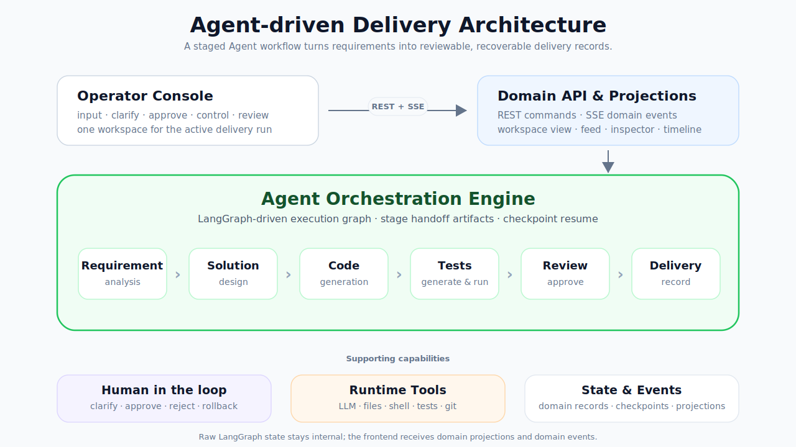

<div align="center">

# AI DevFlow Engine

### Local-first AI engineering workflow engine for requirement-to-delivery pipelines.


English | [简体中文](README.zh.md)

</div>

---

AI DevFlow Engine turns software delivery into a traceable AI workflow. Instead of treating AI development as one prompt and one code change, it models the full path from requirement understanding to solution design, implementation, testing, review, and delivery.

The project is built for teams and builders who need more than code completion: requirements must stay clear, designs must be reviewable before code is written, risky actions need human control, tests need evidence, and every delivery should explain what changed and why.

<div align="center">
  
</div>

## Why It Exists

AI coding tools are strongest when the task is small and context is fresh. Real delivery work is different: intent gets diluted across stages, design decisions disappear into chat history, tests are easy to skip, and review often happens after the original context has faded.

AI DevFlow Engine keeps the process itself in the system:

| Need | How the engine responds |
| --- | --- |
| Preserve requirement intent | Convert user input into structured requirements, acceptance criteria, and stage artifacts. |
| Make solution quality visible early | Produce design, implementation plan, impact scope, and validation records before code execution. |
| Keep humans in control | Route clarification, approval, pause, resume, retry, rollback, and risky tool confirmation through explicit runtime controls. |
| Make delivery auditable | Link requirements, designs, code changes, tests, reviews, and delivery records into one traceable chain. |

## What You Can Run

The current V1 platform surface includes a runnable backend, frontend workspace, and verification stack:

| Area | Current capability |
| --- | --- |
| Backend API | `FastAPI` application with REST routes, error contracts, OpenAPI, startup seeding, CORS, and request correlation. |
| Workspace console | `React` and `Vite` SPA with project/session navigation, requirement composer, narrative feed, inspector, settings, approvals, delivery result blocks, and runtime controls. |
| Runtime path | Deterministic runtime, LangGraph engine boundary, stage runner ports, interrupt/resume handling, event translation, provider adapter, prompt assets, and auto-regression policy support. |
| Persistence and observability | Multi-SQLite session management, domain models, JSONL runtime logs, audit records, redaction, retention, log indexes, and diagnostic query surfaces. |
| Workspace and delivery tools | Isolated workspace management, file and grep tools, controlled shell execution, tool risk gates, demo delivery, and Git delivery boundaries. |
| Verification | Backend pytest suite, frontend Vitest coverage, OpenAPI compatibility checks, and Playwright E2E flows. |

## Workflow At A Glance

| Stage | Purpose | Primary output |
| --- | --- | --- |
| Requirement Analysis | Understand intent, constraints, and acceptance criteria. | Structured requirement |
| Solution Design | Produce the technical approach, implementation plan, and validation result. | Approved design |
| Code Generation | Apply the approved plan to the workspace. | Change set |
| Test Generation & Execution | Generate or run checks and expose remaining gaps. | Test evidence |
| Code Review | Review correctness, safety, test evidence, and plan alignment. | Review decision |
| Delivery Integration | Prepare final delivery output and record the result. | Delivery record |

Human approval is part of the workflow, not an external note. Runtime controls and tool confirmations remain first-class events that can be inspected and replayed through the user-facing projection.

## Product Experience

AI DevFlow Engine is shaped as a local-first engineering workspace:

| Surface | Role |
| --- | --- |
| Workspace console | The main place to submit requirements, inspect runs, approve stages, configure providers, and review delivery. |
| Narrative feed | A readable timeline of stage progress, approvals, tool calls, diffs, tests, and delivery events. |
| Inspector | A detail panel for artifacts, metrics, references, stage records, and runtime state projections. |
| Runtime controls | Pause, resume, terminate, retry, rollback, approval, and tool confirmation controls. |
| Delivery modes | Safe demonstration delivery plus controlled Git delivery concepts for real project handoff. |

## Architecture

<div align="center">
  
</div>

The frontend does not consume raw runtime internals. It reads stable domain objects, query projections, and SSE events while the backend owns orchestration, persistence, tools, and delivery records.

| Layer | Responsibility |
| --- | --- |
| Frontend workspace | React routes, TanStack Query API access, Zustand workspace state, SSE client, feed, inspector, approvals, templates, settings, and delivery views. |
| API and projections | FastAPI commands, query endpoints, OpenAPI contract, domain error responses, run projections, feed entries, metrics, and inspector payloads. |
| Runtime orchestration | Deterministic runtime, LangGraph integration boundary, stage agents, prompt rendering, provider calls, interrupts, resume, and terminal controls. |
| Persistence and logs | Control, runtime, graph, event, and log databases plus JSONL audit/runtime logs with redaction and retention. |
| Workspace and delivery | Controlled file tools, shell execution gates, risk classification, change boundaries, demo delivery, and Git delivery extension points. |

More detail is available in the [architecture overview](docs/architecture/overview.md).

## Quick Start

Backend:

```powershell
uv sync --extra dev
uv run uvicorn backend.app.main:app --reload
```

The API documentation is available at `http://127.0.0.1:8000/api/docs`.

Frontend:

```powershell
npm --prefix frontend install
npm --prefix frontend run dev
```

The workspace runs at `http://127.0.0.1:5173`.

Full setup notes are in [Getting Started](docs/getting-started.md).

## Verification

Backend:

```powershell
uv run pytest
```

Frontend:

```powershell
npm --prefix frontend run build
npm --prefix frontend run test -- --run
```

E2E:

```powershell
npm --prefix e2e run test
npm --prefix e2e run test:live
```

See [Verification](docs/development/verification.md) for the focused commands and live-backend E2E path.

## Documentation

| Document | Purpose |
| --- | --- |
| [Documentation index](docs/README.md) | Entry point for product, architecture, development, API, and plan documents. |
| [Getting Started](docs/getting-started.md) | Local setup, runtime directories, backend/frontend startup, and E2E notes. |
| [Architecture Overview](docs/architecture/overview.md) | System layers, data flow, runtime boundary, observability, and extension points. |
| [Verification](docs/development/verification.md) | Backend, frontend, and E2E verification commands. |
| [Product Overview](docs/specs/function-one-product-overview-v1.md) | Product and stage boundaries for feature one. |
| [Frontend Workspace Design](docs/specs/frontend-workspace-global-design-v1.md) | Workspace interaction and presentation semantics. |
| [Backend Engine Design](docs/specs/function-one-backend-engine-design-v1.md) | Domain model, API, projection, event, and runtime semantics. |
| [Platform Plan](docs/plans/function-one-platform-plan.md) | V1 implementation slices and platform delivery plan. |
| [OpenAPI Notes](docs/api/function-one-openapi-notes.md) | API companion notes and OpenAPI contract guidance. |

## Project Status

AI DevFlow Engine is in V1 platform buildout. The repository now contains the first runnable local platform surface, including backend API modules, frontend workspace modules, deterministic runtime paths, provider and prompt infrastructure, workspace tools, delivery boundaries, observability, and automated tests.

The authoritative feature-one boundaries remain the split specifications under `docs/specs/`. Archived design documents under `docs/archive/` are historical references only.

## License

This project is licensed under the [MIT License](LICENSE).
