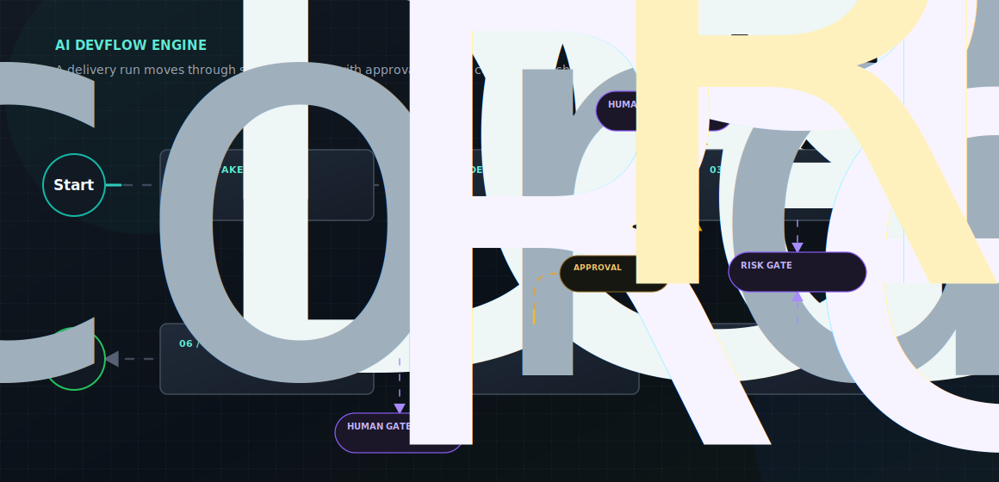

<div align="center">

# AI DevFlow Engine

### AI 驱动的研发全流程引擎。


[English](README.md) | 简体中文

</div>

---

AI DevFlow Engine 是一个 AI 驱动的研发流程引擎。它不把开发理解成一次聊天或一次代码生成，而是把需求理解、方案设计、代码变更、测试、评审和交付组织成一条显式 Pipeline。

这个项目关注当前 AI 编码工具之外的实际缺口：代码补全很有用，但团队仍然需要过程控制，包括需求是否清晰、方案是否合理、变更是否安全、测试是否充分、关键质量点是否经过人工确认，以及最终交付能否说明“为什么这样改”。

AI DevFlow Engine 围绕这些阶段协调专门的 AI Agent，并保留每个阶段产生的结构化产物，让最终交付可以被检查、修正、重试，也能追溯回最初的需求意图。

<div align="center">
  
</div>

## 面向谁

AI DevFlow Engine 面向希望让 AI 参与完整研发流程，而不只是补全代码的团队与开发者。

| 群体 | 他们需要什么 |
| --- | --- |
| 产品与项目负责人 | 从需求意图到实现结果之间有一条可见、可回看的链路。 |
| 技术负责人和评审者 | 能看到结构化方案、风险暴露、质量关口和可追溯决策。 |
| 开发者 | 上下文能从需求分析延续到编码、测试、评审和交付。 |
| AI 平台建设者 | 可复用的 Agent 角色、阶段产物、工具协议、运行控制和交付记录模型。 |

## 解决什么问题

| 痛点 | AI DevFlow Engine 的方式 |
| --- | --- |
| 需求在流转中变模糊 | 将自然语言输入转换为结构化需求和验收标准。 |
| 方案是否合理难以前置判断 | 在编码前产出技术方案、实施计划、影响范围和校验结果。 |
| AI 生成代码缺少过程上下文 | 让每次代码变更都关联已确认的需求、方案和任务计划。 |
| 测试覆盖容易被弱化 | 将测试生成、执行和缺口说明作为正式阶段。 |
| 评审发生时上下文已经散落 | 保留阶段产物和决策记录，让评审能看到变更为什么存在。 |
| 交付结果难以审计 | 生成最终交付记录，关联需求、方案、代码、测试与评审结论。 |

## 交付 Pipeline

| 阶段 | 职责 | 输出 |
| --- | --- | --- |
| Requirement Analysis | 理解用户意图、约束和验收标准。 | 结构化需求 |
| Solution Design | 形成技术方案、实施计划和方案校验结果。 | 已确认方案 |
| Code Generation | 按已确认方案修改工作区。 | 代码变更集 |
| Test Generation & Execution | 生成或执行测试，并暴露剩余测试缺口。 | 测试证据 |
| Code Review | 审查正确性、安全性、测试证据和方案一致性。 | 评审结论 |
| Delivery Integration | 整理最终交付结果与交付记录。 | 可追溯交付 |

人工审批嵌入关键质量关口。澄清、暂停、恢复、终止、回退、重试和高风险工具确认都属于运行链路的一部分，不再散落为独立流程。

## 产品形态

AI DevFlow Engine 规划为一个本地优先的研发工作台：

| 区域 | 产品方向 |
| --- | --- |
| 工作台 | 用户在同一个控制台中输入需求、补充澄清、审批方案、确认风险动作、查看交付结果。 |
| 叙事流 | 用一条可阅读的主流展示系统如何理解、设计、实现、测试、评审和交付。 |
| 详情栏 | 展示输入、过程记录、输出、产物、量化指标和引用关系。 |
| 运行控制 | 支持等待、暂停/恢复、终止、回退、重试、审批和工具确认。 |
| 交付模式 | 支持安全演示交付，也为真实 Git 分支、提交和代码评审请求保留交付链路。 |

<a id="architecture-blueprint"></a>

## 架构蓝图

| 层级 | V1 方向 |
| --- | --- |
| 前端 | 单一 SPA，使用 `React`、`Vite`、`React Router`、`TanStack Query`、`Zustand` 和 `EventSource` 薄封装。 |
| API 表面 | `FastAPI` 暴露 REST 命令、查询投影、SSE 领域事件和 OpenAPI 文档。 |
| 运行时 | `LangGraph` 驱动阶段化执行链路；`LangChain` 负责 Provider、消息、工具绑定和结构化输出集成。 |
| 持久化 | 多 SQLite 按职责拆分，分别承载控制面、运行时、执行图、事件和日志数据。 |
| 可观测性 | JSONL 运行日志、轻量日志索引、审计记录、trace 标识、脱敏、轮转和诊断查询。 |
| 工作区 | 隔离运行工作区、受控文件工具、受控 shell 执行、diff 采集和变更集构建。 |
| 交付 | 安全演示交付，以及受控 Git 分支、提交、推送和代码评审请求流程。 |

运行时原始状态保持为内部实现细节。前端只消费领域对象、查询投影和领域事件，让用户侧工作流在底层实现演进时仍保持稳定。

<a id="development-status"></a>

## 开发状态

本仓库当前处于 V1 平台建设阶段。权威产品边界和实现边界来自 `docs/` 下的拆分规格与平台计划。只有当后续切片创建真实源码、测试、资产或文档时，相关源码目录才成为具体交付内容。

| 区域 | 状态 |
| --- | --- |
| 产品、前端、后端拆分规格 | 已在 `docs/specs/` 定义，处于评审范围。 |
| 平台实施总计划 | 已在 `docs/plans/function-one-platform-plan.md` 定义，并拆分为多个分卷。 |
| 仓库结构边界 | 已记录在 `docs/architecture/project-structure.md`。 |
| 生产后端/前端代码 | 按切片规划推进；本 README 不把它描述为已完成能力。 |
| 历史设计文档 | 仅作为历史参考保留在 `docs/archive/`。 |

## 开发命令

后端命令：

```powershell
python -m venv .venv
.\.venv\Scripts\Activate.ps1
python -m pip install -e ".[dev]"
pytest --collect-only
```

创建 `.venv` 的 Python 解释器必须是 Python 3.11 或更新版本。

前端命令：

```powershell
npm --prefix frontend install
npm --prefix frontend run dev
npm --prefix frontend run build
npm --prefix frontend run test -- --run
```

B0.1 后端基线不创建 FastAPI 应用入口。`backend/app/main.py` 和 API health check 由 B0.2 负责。B0.1 前端基线只创建 Vite/Vitest 工程入口；React 路由、QueryClient、页面和可见控制台 UI 由 F0.1 负责。

## 仓库地图

| 路径 | 用途 |
| --- | --- |
| `docs/specs/` | 当前产品、前端和后端规格集。 |
| `docs/plans/function-one-platform-plan.md` | 平台级 V1 实施总计划。 |
| `docs/plans/function-one-platform/` | 实施切片分卷计划。 |
| `docs/plans/implementation/` | 单个切片的执行期实施计划。 |
| `docs/architecture/` | 持久架构说明与路径责任边界。 |
| `assets/` | README 与文档视觉资源。 |
| `refs/` | 项目工作参考与开发记录。 |

## 当前规格集

- 产品边界：[`docs/specs/function-one-product-overview-v1.md`](docs/specs/function-one-product-overview-v1.md)
- 前端工作台设计：[`docs/specs/frontend-workspace-global-design-v1.md`](docs/specs/frontend-workspace-global-design-v1.md)
- 后端引擎与协作契约：[`docs/specs/function-one-backend-engine-design-v1.md`](docs/specs/function-one-backend-engine-design-v1.md)

当这些文档出现重叠时，产品总纲负责产品边界和阶段边界，前端设计负责交互与展示语义，后端设计负责领域模型、API、投影和事件语义。

## 范围边界

V1 聚焦本地项目交付工作流，不包含浏览器注入、页面圈选编辑、多租户计费、独立审批中心、自定义阶段编排器或大规模分布式执行。设计上将这些内容排除在首个版本之外，同时为后续能力保留后端扩展边界。

## 许可证

本项目使用 [MIT License](LICENSE)。
